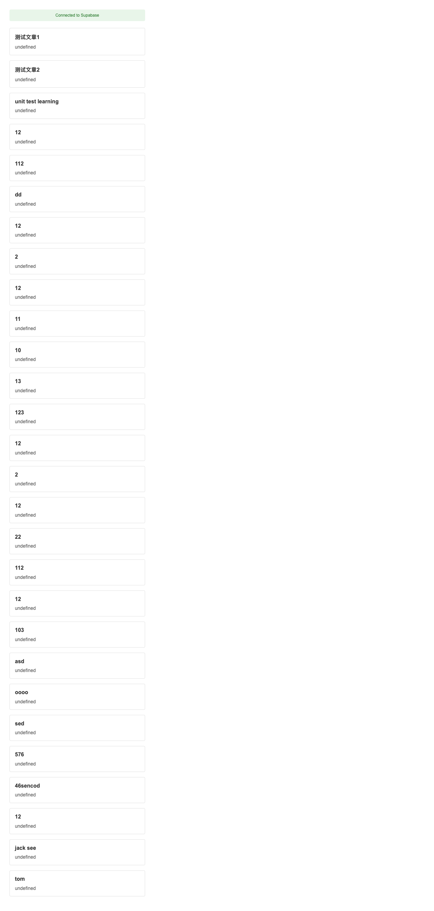
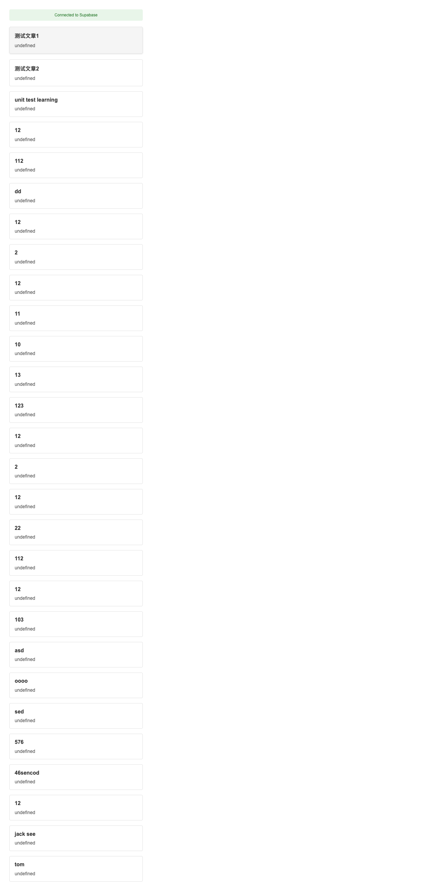

# Talk-G Chrome 扩展

一个集成 Supabase 后端的 Chrome 文章管理和阅读扩展。

## 功能特点

- 📚 文章列表视图
  - 清新现代的界面设计
  - 带标题和描述的文章预览
  - 流畅的悬停动画效果
  - 点击查看完整文章详情
  
- 📖 文章详情视图
  - 完整的文章内容展示
  - 便捷的返回按钮导航
  - 清晰的排版提升阅读体验
  
- 🔧 技术特性
  - Supabase 数据存储集成
  - 完整的测试套件
  - UI 一致性截图测试
  - 错误处理和状态提示

## 界面截图

### 文章列表视图


### 文章详情视图


### 错误状态


## 开发指南

### 环境要求

- Node.js (v14 或更高版本)
- npm
- Chrome 浏览器
- Supabase 账号和项目

### 安装步骤

1. 克隆仓库：
```bash
git clone https://github.com/yourusername/talk-g.git
cd talk-g
```

2. 安装依赖：
```bash
npm install
```

3. 配置 Supabase：
   - 创建 `.env` 文件并填入 Supabase 凭证
   - 在 `js/config.js` 中更新项目配置

4. 构建扩展：
```bash
npm run build
```

5. 在 Chrome 中加载扩展：
   - 打开 Chrome，访问 `chrome://extensions`
   - 启用开发者模式
   - 点击"加载已解压的扩展程序"，选择 `dist` 目录

### 测试

项目包含多种测试类型：

- 单元测试：
```bash
npm run test
```

- 集成测试：
```bash
npm run test:integration
```

- 截图测试：
```bash
npm run test:screenshot
```

### 项目结构

```
talk-g/
├── dist/               # 构建后的扩展文件
├── js/                 # JavaScript 源文件
│   ├── popup.js       # 主扩展UI逻辑
│   ├── background.js  # 后台服务工作进程
│   └── config.js      # 配置文件
├── docs/              # 文档
│   └── images/        # 截图和图片
├── tests/             # 测试文件
└── popup.html         # 扩展弹出页面HTML
```

## 参与贡献

1. Fork 本仓库
2. 创建特性分支 (`git checkout -b feature/amazing-feature`)
3. 提交更改 (`git commit -m '添加精彩特性'`)
4. 推送到分支 (`git push origin feature/amazing-feature`)
5. 提交 Pull Request

## 许可证

本项目采用 MIT 许可证 - 详见 LICENSE 文件。

## 致谢

- [Supabase](https://supabase.io/) 提供后端基础设施
- [Chrome Extension APIs](https://developer.chrome.com/docs/extensions/reference/) 使本项目成为可能
- 所有为代码、问题和想法做出贡献的贡献者

[View in English](README.md)
[View in Japanese (日本語で表示)](README_JP.md)
