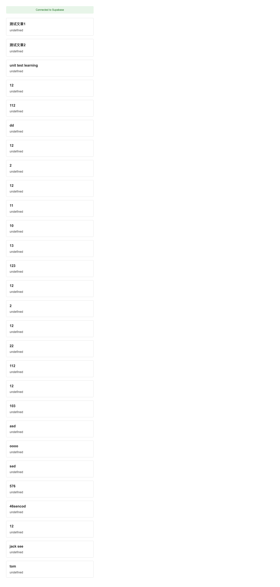

# Talk-G Chrome 拡張機能

Supabaseバックエンドを統合した記事管理・閲覧用Chrome拡張機能です。

## 機能

- 📚 記事一覧表示
  - クリーンでモダンなUI
  - タイトルと説明付きの記事プレビュー
  - スムーズなホバーアニメーション
  - クリックで記事の詳細を表示
  
- 📖 記事詳細表示
  - 記事の全文表示
  - 戻るボタンで簡単ナビゲーション
  - 読みやすい文字組み
  
- 🔧 技術的特徴
  - Supabaseによるデータストレージ統合
  - 包括的なテストスイート
  - UIの一貫性を確認するスクリーンショットテスト
  - エラー処理とステータスメッセージ

## スクリーンショット

### 記事一覧


### 記事詳細


### エラー状態


## 開発

### 前提条件

- Node.js (v14以上)
- npm
- Chromeブラウザ
- Supabaseアカウントとプロジェクト

### セットアップ

1. リポジトリのクローン：
```bash
git clone https://github.com/yourusername/talk-g.git
cd talk-g
```

2. 依存関係のインストール：
```bash
npm install
```

3. Supabaseの設定：
   - `.env`ファイルにSupabaseの認証情報を設定
   - `js/config.js`でプロジェクト詳細を更新

4. 拡張機能のビルド：
```bash
npm run build
```

5. Chromeに拡張機能を読み込む：
   - Chromeで`chrome://extensions`を開く
   - デベロッパーモードを有効にする
   - 「パッケージ化されていない拡張機能を読み込む」をクリックし、`dist`ディレクトリを選択

### テスト

プロジェクトには複数のタイプのテストが含まれています：

- ユニットテスト：
```bash
npm run test
```

- 統合テスト：
```bash
npm run test:integration
```

- スクリーンショットテスト：
```bash
npm run test:screenshot
```

### プロジェクト構造

```
talk-g/
├── dist/               # ビルドされた拡張機能ファイル
├── js/                 # JavaScriptソースファイル
│   ├── popup.js       # メイン拡張機能UIロジック
│   ├── background.js  # バックグラウンドサービスワーカー
│   └── config.js      # 設定
├── docs/              # ドキュメント
│   └── images/        # スクリーンショットと画像
├── tests/             # テストファイル
└── popup.html         # 拡張機能ポップアップHTML
```

## 貢献

1. リポジトリをフォーク
2. 機能ブランチを作成 (`git checkout -b feature/amazing-feature`)
3. 変更をコミット (`git commit -m '素晴らしい機能を追加'`)
4. ブランチにプッシュ (`git push origin feature/amazing-feature`)
5. Pull Requestを開く

## ライセンス

このプロジェクトはMITライセンスの下で公開されています - 詳細はLICENSEファイルを参照してください。

## 謝辞

- [Supabase](https://supabase.io/) - バックエンドインフラストラクチャの提供
- [Chrome Extension APIs](https://developer.chrome.com/docs/extensions/reference/) - 本プロジェクトを可能にした
- コード、課題、アイデアに貢献してくださったすべての貢献者

[英語で表示](README.md)
[中国語で表示 (查看中文版)](README_CN.md)
